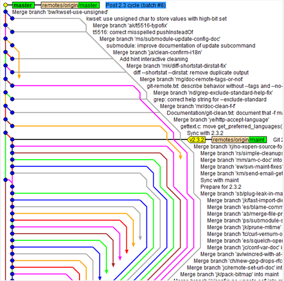
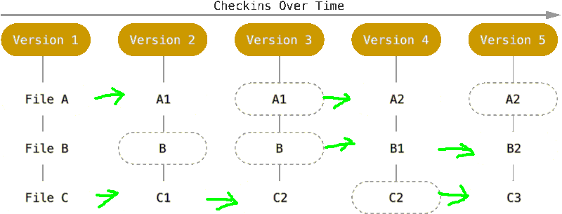

Understanding Git
=================

2019-05

Michał Bultrowicz

---------------

What is Git?
------------

::

   $ man git

::

   GIT(1)          Git Manual          GIT(1)

   NAME
          git - the stupid content tracker

------------

What is Git?
------------

* distributed source control
* collaboration
* explaining train of thought/work
* came out of Linux kernel development

------------

This presentation
-----------------

* My mental model.
* GUI not used (concepts don't need it)

More info: https://git-scm.com/book

----------------

Demo
----

----------------

Git branching
-------------

https://learngitbranching.js.org/

------------------

Merges, merges...
-----------------

------------------

Commits as snapshots
--------------------

----------------

